<p align="center">
  
</p>

<p align="center">
  
</p>


## 📓 Ficha do Portador

```java
public class PortadorDoCaderno {
    String nome        = "Gabriel Cauê";
    String classe      = "Desenvolvedor Backend Java";
    String nivel       = "Júnior";
    String base        = "São Paulo, SP · Remoto / Híbrido";
    String[] arsenal   = { "Java", "Spring Boot", "SQL", "Docker" };
    String missao      = "Construir APIs robustas e escaláveis";
    boolean recrutavel = true; // 🟢 aberto a oportunidades
}
```

> **限界を超えろ** — *Supere seus limites.*


## 👁️ Olhos de Shinigami — Nível de Poder

<p align="center">
  
</p>

## 🖋️ Instrumentos de Escrita

<p align="center">
  
</p>


## 🕵️ Casos Resolvidos

| Caso | Objetivo | Stack | Arquivo |
|---|---|---|---|
| ⚔️ **[Projeto 1]** | API REST para [problema que resolve] | Java · Spring Boot · PostgreSQL | [🔗 Repo](https://github.com/gabrielcaue/projeto-1) |
| 🛡️ **[Projeto 2]** | Autenticação com JWT e controle de acesso | Spring Security · Docker | [🔗 Repo](https://github.com/gabrielcaue/projeto-2) |
| 🔥 **[Projeto 3]** | Microsserviços com mensageria | Spring Cloud · Kafka | [🔗 Repo](https://github.com/gabrielcaue/projeto-3) |

## 🧩 Investigação em Andamento

- 🔍 Investigando: **[ex.: microsserviços com SignUp]**
- 📌 Próximo suspeito: **[ex.: Rede Blockchain Metamask]**
- 🎯 Procurando: **vaga de Desenvolvedor Java Júnior** — CLT ou PJ, remoto ou híbrido


## 📊 Registros do Caderno

<p align="center">
  
  
</p>


<p align="center">
  
</p>


## 📕 Regras de Uso

> **I.** O recrutador que escrever o nome deste dev em uma proposta terá seu backend entregue no prazo.
>
> **II.** Se nenhuma stack for especificada, o dev usará Java com Spring Boot.
>
> **III.** Todo bug registrado neste caderno será encontrado, investigado e eliminado antes do próximo deploy.
>
> **IV.** Este caderno não pode ser usado para colocar em produção código sem testes.
>
> **V.** O portador deste caderno está disponível para novas oportunidades.

## 🍎 Ofereça uma maçã — Contato

<p align="center">
  <a href="https://www.linkedin.com/in/SEU_LINKEDIN/"></a>
  <a href="mailto:seuemail@exemplo.com"></a>
  <a href="https://SEU_PORTFOLIO.com"></a>
</p>

<p align="center">
  
</p>

<p align="center"><i>"A justiça sempre vence — especialmente com cobertura de testes." 🍎</i></p>
